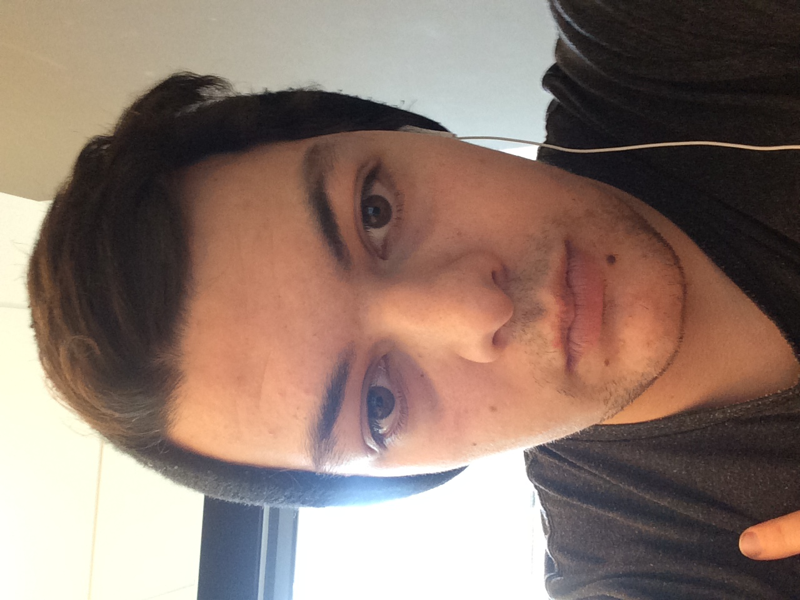
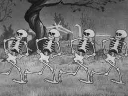
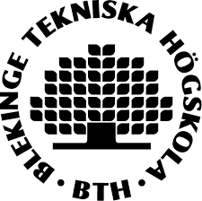

Om
=========================

Detta är min projekt hemsida för kursen ramverk1-v1 med ett halloween tema.
På denna sidan kan du skapa ett konto, logga in, ställa fråger med taggar och besvara
fråger med kommentarer. Denna sidan kan rättare sakt göra dem tre första kraven
som beskrivs i denna länken [krav :)](https://dbwebb.se/kurser/ramverk1-v1/kmom10).

Denna sidans finns på [Github](https://github.com/KifeKenny/ramverk1-proj). Där beskrivs
vad du ska göra om du vill sätta upp denna sidan själv och vilka programm jag använder
för att mäta kodstandar, tester, osv.

Den som har gjort denna sidan är jag och mitt namn är Kevin Olguin Jönsson. Jag
studerar just nu mitt sista år på Blekinges tekniska högskola.

